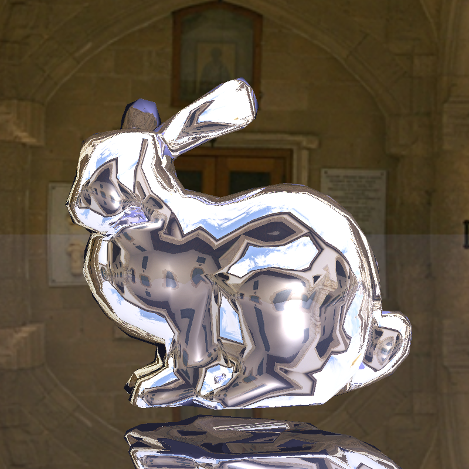
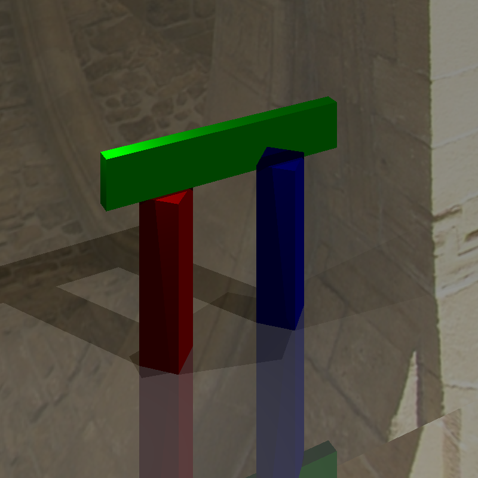
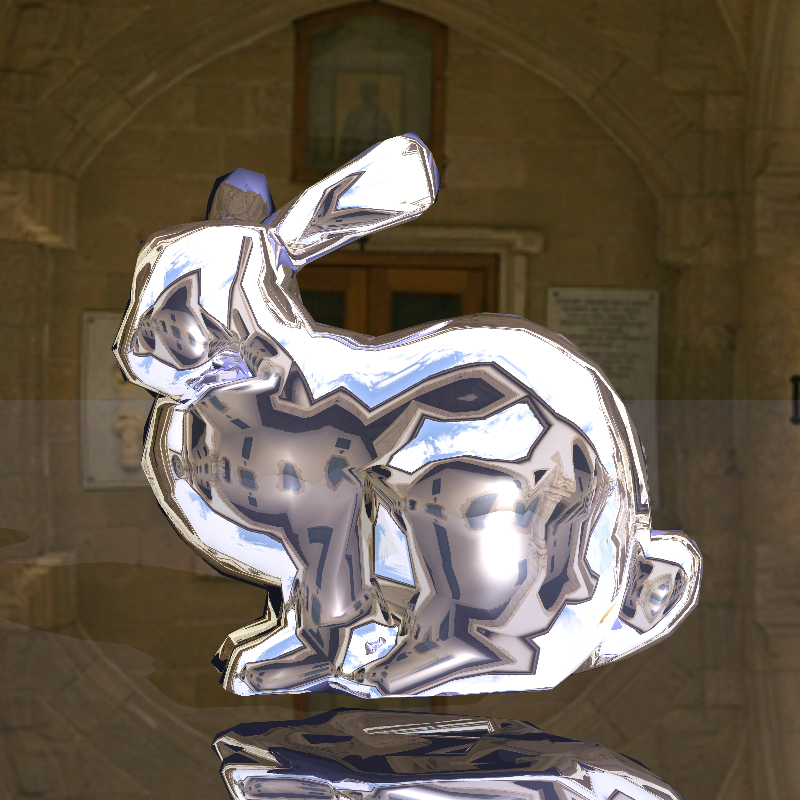

# Project 2 实验报告：光照模型与光线追踪

## 分工

1. **李泽栋**

   学号：23307130271

   任务：完成任务1以及任务2，并撰写相关报告

2. **朱雅伦**

   学号：24300240187

   任务：完成任务3以及拓展任务，并撰写相关报告

---

## 任务 1、2：光线投射

首先我们分析`PerspectiveCamera`的代码：

```cpp
class PerspectiveCamera : public Camera
{
public:
    PerspectiveCamera(const Vector3f &center,
        const Vector3f &direction,
        const Vector3f &up,
        float angleradians) :
        _center(center),                        // postion of the camera
        _direction(direction.normalized()),     // direction of the camera
        _up(up),                                // up vector of the camera
        _angle(angleradians)                    // field of view in radians
    {
        _horizontal = Vector3f::cross(direction, up).normalized();
    }

    virtual Ray generateRay(const Vector2f &point) override
    {
        // BEGIN STARTER
        float d = 1.0f / (float)std::tan(_angle / 2.0f);
        Vector3f newDir = d * _direction + point[0] * _horizontal + point[1] * _up;
        newDir = newDir.normalized();

        return Ray(_center, newDir);
        // END STARTER
    }

    virtual float getTMin() const override
    {
        return 0.0f;
    }
};
```

我们可以知道摄像头距离屏幕的距离为 $d = \frac{1}{\tan{(\text{angle} / 2)}}$ ，而屏幕大小固定。

参数 `point` 是对应屏幕上的像素位置，范围是 [-1, 1] × [-1, 1]，其中：

- `(-1, -1)` = 屏幕左下角
- `(1, 1)` = 屏幕右上角
- `(0, 0)` = 屏幕正中心

`getTMin` 是返回**最小有效距离**，意思是：只考虑 `t >= tmin` 的交点，忽略太近的交点。因为相机本身不是物体，不会参与相交测试，并且第一个有效交点必须从 `t > 0` 开始，所以这里 `tmin = 0` 是合理的。

### 1.1 Phong光照模型

#### 1.1.1 PointLight::getIllumination()

计算点光源对场景中某一点的照明参数：

```cpp
// 计算从交点指向光源的方向
tolight = _position - p;
distToLight = tolight.abs();
tolight = tolight.normalized();

// 距离衰减公式：I = I_source / (α × d²)
float attenuation = _falloff * distToLight * distToLight;
intensity = _color / attenuation;
```

核心要点：

- 方向：交点 → 光源位置
- 衰减：光强随距离平方衰减，衰减因子 `_falloff` 控制衰减强度

#### 1.1.2 Material::shade()

实现Phong模型的漫反射和镜面反射计算：

漫反射项：

```cpp
float LNdot = Vector3f::dot(L, N);
Vector3f diffuse = Vector3f::ZERO;
if (LNdot > 0) {
    diffuse = LNdot * lightIntensity * _diffuseColor;
}
```

镜面反射项：

```cpp
Vector3f specular = Vector3f::ZERO;
if (LNdot > 0 && _shininess > 0) {
    // compute view vector (from hit point to camera = -ray.getDirection().normalized())
    Vector3f E = -ray.getDirection().normalized();

    // compute perfect reflection vector
    // R = 2(N·E)N - E
    Vector3f R = 2 * Vector3f::dot(N, E) * N - E;
    R = R.normalized();

    // compute reflection dot product
    float LRdot = Vector3f::dot(L, R);
    if (LRdot > 0) {
        float specularFactor = pow(LRdot, _shininess);
        specular = specularFactor * lightIntensity * _specularColor;
    }
}
// 其中 R = 2(N·E)N - E（E为视线方向）
```

核心要点：

- 只有当 N·L > 0 时光源在表面上方才计算
- 反射向量由视线方向 E 决定，而非光源方向
- 光泽度 `_shininess` 控制高光集中程度

#### 1.1.3 Renderer::traceRay()

在主循环中完成光照累加：

```cpp
// 1. 计算交点坐标
Vector3f hitPoint = r.pointAtParameter(h.getT());

// 2. 遍历所有光源，累加直接光照
for each light:
    light->getIllumination(hitPoint, ...);
    directLight += material->shade(...);

// 3. 最终颜色 = 环境光 + 直接光照
return ambient + directLight;
```

完成本任务后，程序能够正确渲染带有明暗变化和镜面高光的场景中的球体的光照（如 `scene01_plane.txt`），球体呈现符合Phong模型的光照效果。

### 1.2 光线投射

在 `Renderer::traceRay` 中我们会先调用 `_scene.getGroup()->intersect(r, tmin, h)` 对场景中的 `Group` ，即所有物体的集合，查看摄像头射出的光线 `r` 是否会经过任意一个物体，并且如果发现命中点 `h` 与摄像机原点存在更短距离，则更新 `h` 的 `t` 。

```cpp
Vector3f
Renderer::traceRay(const Ray &r,
    float tmin,
    int bounces,
    Hit &h) const
{
    // The starter code only implements basic drawing of sphere primitives.
    // You will implement phong shading, recursive ray tracing, and shadow rays.

    // TODO: IMPLEMENT 
    if (_scene.getGroup()->intersect(r, tmin, h)) {
        ...

        // 最终颜色 = 环境光 + 直接光照
        return ambient + directLight;
    } else {
        // 返回背景色
        return _scene.getBackgroundColor(r.getDirection());
    };
}
```

我们可知`Group::intersect(const Ray &r, float tmin, Hit &h)` 的各项参数：

| 参数   | 类型          | 说明                                                         |
| :----- | :------------ | :----------------------------------------------------------- |
| `r`    | `const Ray &` | 输入待测试的光线，包含起点(origin)和方向(direction)          |
| `tmin` | `float`       | 输入最小有效距离阈值，只考虑 `t >= tmin` 的交点              |
| `h`    | `Hit &`       | 存储交点信息。输入时带有当前最近的交点；输出时如果找到更近的交点则更新 |

#### 1.2.1 Plane（平面）

平面方程：`P · n = d`

相交推导：

- 光线方程：`P = origin + t × direction`
- 代入得：`(origin + t×d) · n = d`
- 解得：`t = (d - origin·n) / (direction·n)`

实现要点：

- 判断分母是否为0（光线与平面平行则无交点）
- 检查 `t` 是否在有效范围 `[tmin, h.getT()]` 内

```cpp
float dn = Vector3f::dot(r.getDirection(), _normal);
if (fabs(dn) < 1e-6) return false;
float t = (_d - Vector3f::dot(r.getOrigin(), _normal)) / dn;
```

#### 1.2.2 Triangle（三角形）

算法：Möller-Trumbore 重心坐标算法

核心思路：

- 用重心坐标 `(u, v)` 表示三角形内任意点：`P = (1-u-v)v0 + u·v1 + v·v2`
- 我们可通过变换得新的方程：`[-d, e1, e2] × [t, u, v] = s` 。其中：
  - `d` = 光线方向
  - `e1 = v1 - v0`，`e2 = v2 - v0`（三角形两条边）
  - `s = origin - v0`（从 v0 到光线起点的向量）
- 将光线方程与三角形方程联立，解出 `t`、`u`、`v`
- `u ≥ 0`、`v ≥ 0`、`u+v ≤ 1` 时交点在三角形内

叉积法优化：利用克莱姆法则直接求解，避免显式求逆矩阵

```cpp
float divisor = Vector3f::dot(d, Vector3f::cross(e1, e2));
float t = Vector3f::dot(Vector3f::cross(e2, s), e1) / divisor;
float u = Vector3f::dot(Vector3f::cross(d, e2), s) / divisor;
float v = Vector3f::dot(Vector3f::cross(e1, d), s) / divisor;
```

顶点法线插值：

```cpp
Vector3f normal = (1-u-v) * _n0 + u * _n1 + v * _n2;
```

#### 1.2.3 Transform（变换）

核心思想：将光线从世界坐标变换到局部坐标，与子对象求交，再将结果变换回世界坐标

变换步骤：

1. 光线原点：`newOrigin = invM × origin`
2. 光线方向：`newDir = invM × direction`（归一化）
3. 局部坐标系中求交
4. 法线变换：`worldNormal = transInvM × localNormal`

关键点：

- `t` 值在变换前后保持不变
- 法线必须用逆转置矩阵变换，保证与几何面的垂直关系

```cpp
Matrix4f _invMatrix = m.inverse();           // 逆矩阵
Matrix4f _invTranspose = _invMatrix.transposed(); // 逆转置矩阵
```

### 1.3 场景 1 ~ 5 结果

 


经对比，程序能够正确渲染场景1~5，实验成功。

---

## 任务 3：光线追踪与阴影投射

### 1.1 实现原理

#### 1.1.1 递归光线追踪

光线追踪的核心在于模拟光线在物体表面的多次反射。当光线击中具有镜面反射属性（Specular）的材质时，我们根据法线 **$N$** 和入射方向（视线反方向）**$V$** 计算反射方向 **$R$**：

$$
R = 2(N \cdot V)N - V
$$

通过递归调用 `traceRay`，我们可以获取反射路径上的颜色。最终像素颜色的计算公式为：

$$
I_{total} = I_{ambient} + I_{direct} + k_s \times I_{reflected}
$$



#### 1.1.2 阴影投射

为了确定点光源是否能照亮命中点，我们从命中点向光源发射一根  **阴影射线** 。

* **自相交处理** ：为了防止由于浮点数精度导致的“自遮挡”现象，射线起点需沿法线方向进行微小偏移（即代码中的 `0.001f`）。
* **遮挡判定** ：若阴影射线在 **$t \in [0.001, \text{distToLight}]$** 范围内检测到交点，则该点处于阴影中，不计算直接光照。

### 1.2 关键代码实现 (`Renderer.cpp`)

```cpp
// 简化版核心逻辑展示
Vector3f Renderer::traceRay(const Ray &r, float tmin, int bounces, Hit &h) const {
    if (!_scene.getGroup()->intersect(r, tmin, h)) 
        return _scene.getBackgroundColor(r.getDirection());

    Material* mat = h.getMaterial();
    Vector3f N = h.getNormal().normalized();
    Vector3f hitPoint = r.pointAtParameter(h.t);
  
    // 1. 环境光
    Vector3f ambient = _scene.getAmbientLight() * mat->getAmbientColor();
    Vector3f directLight(0, 0, 0);

    // 2. 直接光照与阴影
    for (int i = 0; i < _scene.getNumLights(); ++i) {
        Vector3f dirToLight, lightIntensity;
        float distToLight;
        _scene.getLight(i)->getIllumination(hitPoint, dirToLight, lightIntensity, distToLight);

        Ray shadowRay(hitPoint + dirToLight * 0.001f, dirToLight);
        Hit shadowHit;
        if (!_args.shadows || !_scene.getGroup()->intersect(shadowRay, 0.001f, shadowHit) || shadowHit.getT() > distToLight) {
            directLight += mat->shade(r, h, dirToLight, lightIntensity);
        }
    }

    // 3. 递归反射 (Indirect Light)
    Vector3f indirectLight(0, 0, 0);
    if (bounces > 0 && mat->getSpecularColor().length() > 0.001f) {
        Vector3f V = -r.getDirection().normalized();
        Vector3f R = (2.0f * Vector3f::dot(N, V) * N - V).normalized();
        Ray reflectedRay(hitPoint + N * 0.001f, R);
        Hit reflectedHit;
        indirectLight = traceRay(reflectedRay, 0.001f, bounces - 1, reflectedHit) * mat->getSpecularColor();
    }

    return ambient + directLight + indirectLight;
}
```



---

## 拓展任务：抗锯齿

### 2.1 实现原理

由于每个像素只采集中心点的信息，当场景中存在高频几何边缘时，会产生阶梯状的 **锯齿** 。

#### 2.1.1 抖动采样

我们不再固定抓取像素中心，而是在像素区域内引入随机偏移，进行多次采样取平均。这种方法将锯齿转化成了人眼较易接受的噪声。

#### 2.1.2 高斯滤波

为了进一步提升平滑度，本实验采用了 **超采样 (Supersampling)** 结合 **高斯平滑** 的方案：

1. **3倍上采样** ：将 **$300 \times 300$** 的图像渲染为 **$900 \times 900$**。
2. **加权卷积** ：使用 **$3 \times 3$** 高斯核对像素及其邻域进行加权。
3. **下采样** ：将过滤后的结果归一化并回填至原始尺寸。

### 2.2 抗锯齿效果对比

| **参数**                 | **渲染时间** | **视觉效果**                       |
| ------------------------------ | ------------------ | ---------------------------------------- |
| **基础渲染**             | ~5s                | 边缘锯齿明显，反射不连续                 |
| **-jitter (16 samples)** | ~80s               | 锯齿大幅减少，边缘出现轻微柔化           |
| **-jitter -filter**      | ~240s              | 边缘极度平滑，光影过渡自然，画质类似照片 |

#### 2.2.1渲染场景 6 兔子




（从上至下：含阴影基础渲染、仅抖动渲染、抗锯齿+抖动渲染）

## 总结

本实验从基础的光线投射出发，逐步实现了完整的Whitted风格光线追踪器，并完成了抗锯齿等画质提升功能。

### 光线投射与Phong光照

在基础部分，我们实现了PerspectiveCamera的射线生成逻辑，推导了相机成像平面与视场角的关系。在光照模型方面，完成了PointLight的照明参数计算（含距离平方衰减）以及Material::shade()中Phong模型的漫反射项和镜面反射项的实现，并验证了环境光+漫反射+镜面高光组合下的正确渲染效果。

在几何相交测试中，分别实现了：
- **平面（Plane）**：通过解平面方程与光线方程的交点，处理了光线与平面平行的情况
- **三角形（Triangle）**：采用Möller-Trumbore重心坐标算法，高效求解交点并支持顶点法线插值
- **变换（Transform）**：通过逆矩阵将光线变换到局部坐标系求交，并用逆转置矩阵将法线变换回世界坐标系

上述实现使得程序能够正确渲染scene01至scene05，验证了光线投射管线与Phong光照模型的正确性。

### 光线追踪、阴影投射与抗锯齿

在任务一、二的基础上，实现了递归光线追踪和阴影投射：

本实验完成了包含多级 **$bounces$** 递归反射、硬阴影投射在内的核心任务，并成功实现了抖动采样与高斯滤波等高质量抗锯齿拓展功能。在技术实施层面，我们通过引入 **$\epsilon = 0.001$** 的射线起点偏移，显著提升了数值稳定性并有效消除了自相交产生的黑斑；面对抗锯齿处理带来的巨大计算压力，明确了通过 OpenMP 循环并行化来平衡性能的优化路径；同时，所有采样平均处理均坚持在线性空间内完成，从底层逻辑上保证了物理渲染的准确性。

### 整体总结

本实验完整实现了一个支持多材质（漫反射/高光/镜面反射）、多几何体（球体/平面/三角形/变换组）、多光源（点光源）的光线追踪渲染器。在技术实施层面，通过引入ε偏移有效解决了自相交黑斑问题，通过重心坐标算法实现了高效的三角形求交，通过递归光线追踪实现了镜面反射效果，并通过抖动采样+高斯滤波显著提升了最终图像质量。
